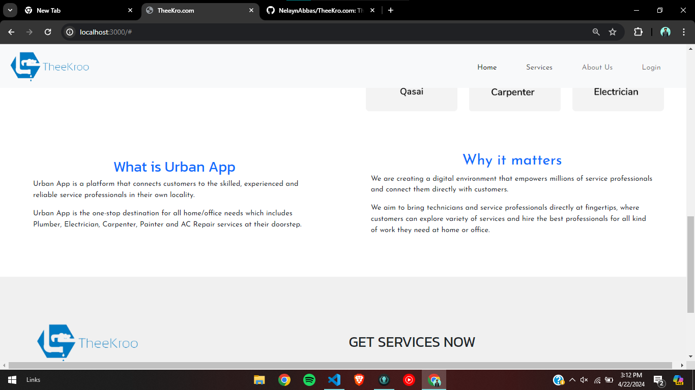

## Theekro.com

#Theek Kro

Welcome to Theekro.com, your one-stop platform for on-demand home services. Whether you need a skilled plumber to fix a leak, a licensed electrician for wiring upgrades, or a certified technician for appliance repairs, we connect you with the right professional for the job. Create a free account, browse through our extensive range of services, and book with confidence knowing that all our providers are vetted and experienced. Your home maintenance needs, simplified.

(<a href="#readme-top">back to top</a>)

## Theekro.com | Tools & Technology

* 
* 
* 
* 
* 

(<a href="#readme-top">back to top</a>)

## Landing Page

### Home

### Services

### About Us

### Footer

## Login Page

### Login

### Sign Up

### Form Validation

### Files Format

